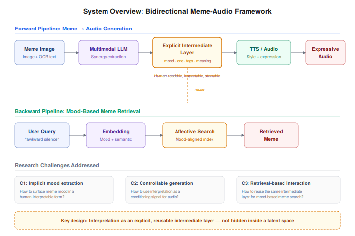

# MemeSonic

**MemeSonic: Giving Memes a Voice Through Affective Multimodal Generation**

> A multimodal prototype that interprets the mood and meaning of a meme image and generates matching expressive audio — built for MIT MAS.S60 Multimodal AI (Spring 2026).

---

**Gaps**
- Existing models struggle to decode semantic irony and cultural nuance in memes
- Dynamic meme generation, especially the acoustic dimension, remains largely unaddressed

**Applications**
- Automatic audio generation for memes conditioned on visual + textual content
- Text-based retrieval of audio-enriched memes

**Pipeline**

- **Multimodal sentiment fusion** — visual + textual encodings → structured affective representation
- **Sentiment-conditioned audio generation** — audio reflecting the meme's intent (irony, absurdity, triumph)
- **Cross-modal alignment** — vision–language–audio alignment as training objective and evaluation criterion
- **Retrieval** — text-based lookup returning memes with generated audio

**Current Challenges**
- Irony and cultural nuance remain hard for vision-language models to capture
- No large-scale labeled dataset for meme sentiment with audio; we construct our own
- Cross-modal alignment across three modalities is technically demanding and hard to evaluate

---

## Homeworks

| | Topic | Link |
|---|---|---|
| HW1 | **`music+motion`** Music & Motion Data Preparation | [homework/homework1/](homework/homework1/README.md) |
| HW2 | **`meme`** Meme Fusion and Alignment | [homework/homework2/](homework/homework2/README.md) |
| HW3 | **`meme`** Meme LLM Fine-tuning | [homework/homework3/](homework/homework3/README.md) |
