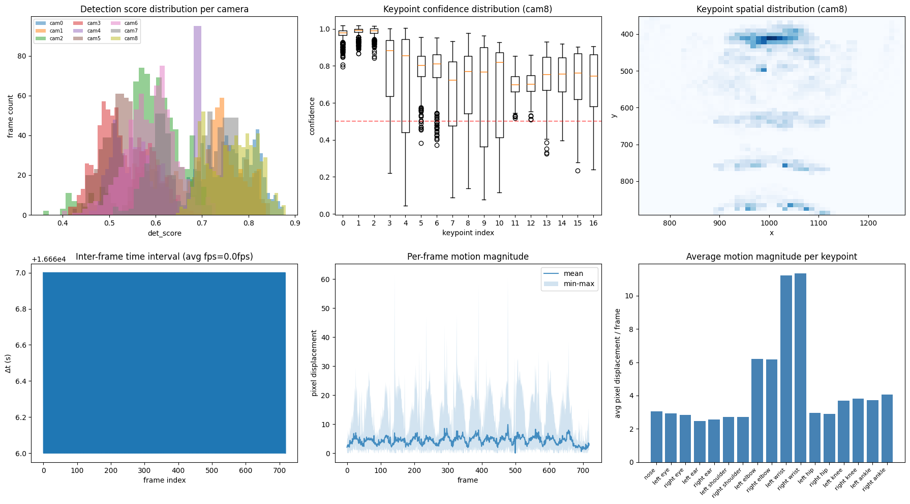
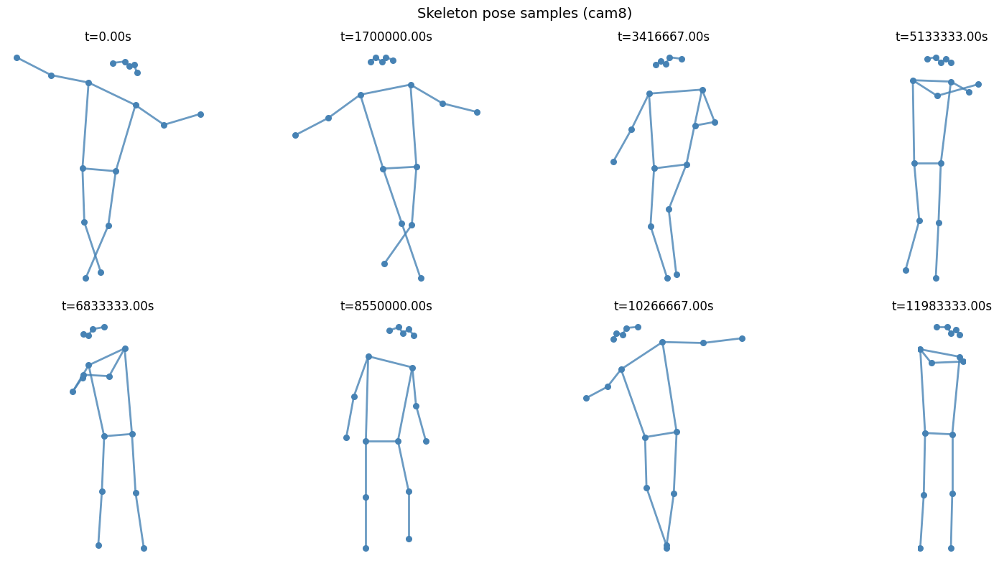
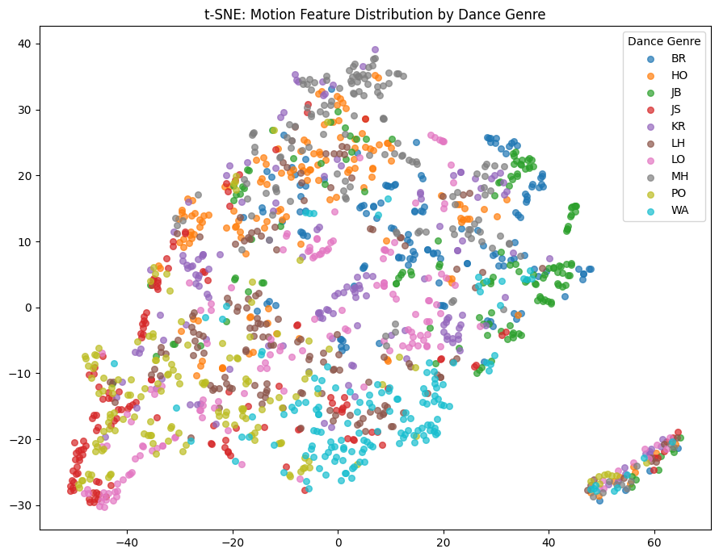
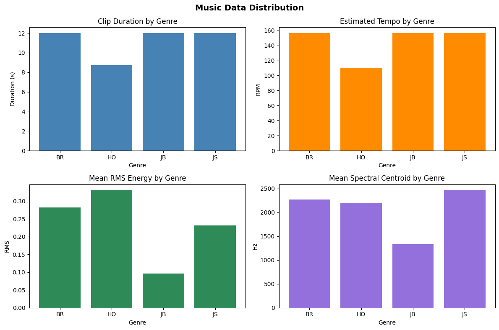
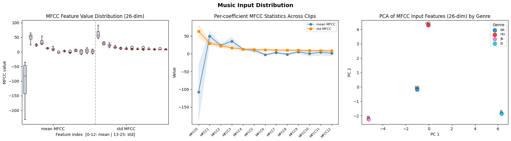
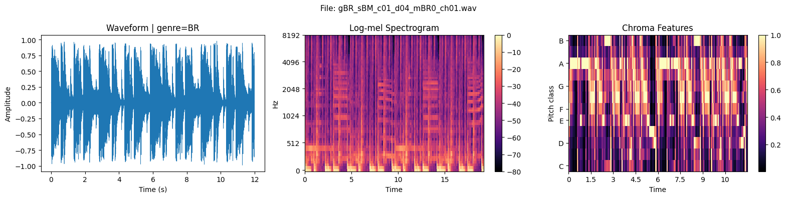
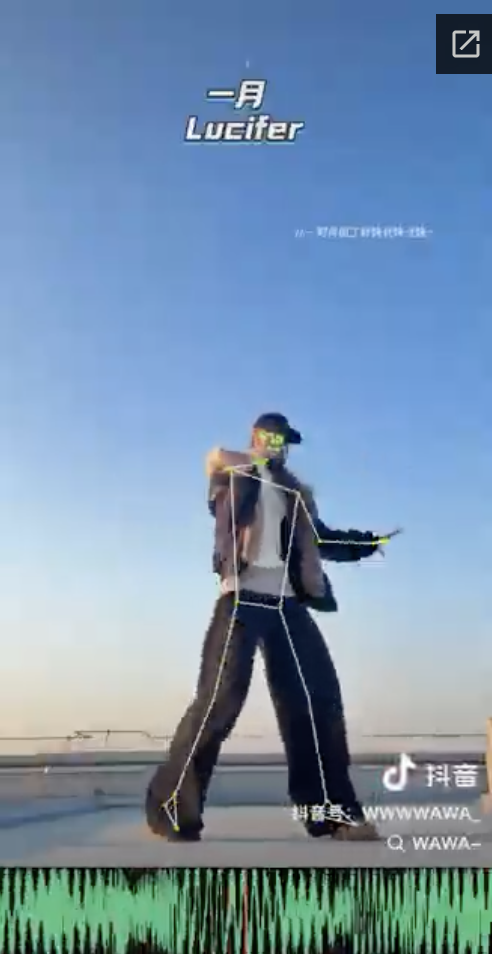

# MMAI HW1 — Music & Motion Data Preparation

Multimodal data preprocessing pipeline for music-aligned dance, using the [AIST++](https://google.github.io/aistplusplus_dataset/) dataset.

---

## Project Goal

Build a music-motion alignment model that jointly evaluates **rhythm**, **beat**, and **semantic consistency** between music and motion. The downstream task is generating or evaluating dance motion conditioned on music.

---

## Dataset

**AIST++** — a large-scale dance video dataset with synchronized music and 2D/3D skeleton keypoints.

- **Motion modality**: 2D keypoints (17 joints, COCO format) extracted per camera view, stored as `.pkl` files
- **Music modality**: audio extracted from dance videos (`.wav`), covering genres BR, HO, JB, JS, etc.
- **Limitation**: Only instrumental music; lyrics unavailable due to copyright restrictions

---

## 1. Motion Modality

### Distribution

Six diagnostic plots confirm data quality:

- Detection score distribution across cameras
- Keypoint confidence boxplots (per joint)
- Keypoint spatial heatmap
- Inter-frame interval stability
- Per-frame motion magnitude
- Average motion per keypoint

### Samples

Static skeleton snapshots at 8 evenly-spaced timestamps from one dance clip:

### t-SNE Embedding (Motion Features)

51-dim handcrafted features (mean/std/max velocity per joint) projected with t-SNE, colored by dance genre:

---

## 2. Music Modality

### Distribution

Per-genre statistics (4 clips): clip duration, estimated tempo (BPM), RMS energy, and spectral centroid:

### MFCC Feature Distribution

26-dim MFCC stats (mean + std of 13 coefficients) shown as box plots and PCA scatter:

### Sample Waveform & Spectrogram

Waveform, log-mel spectrogram, and chroma features for one clip (BR genre):

### Real-world Example

TikTok dance clip with skeleton overlay and audio waveform — demonstrating the kind of music-motion alignment this pipeline targets:

---

## 3. Evaluation Metric

**Beat Alignment Score (BAS)**: fraction of motion peaks falling within ±0.05s of a detected music beat.

| Pros | Cons |
|---|---|
| Label-free, interpretable (0–1) | Sensitive to beat detection errors |
| Directly measures rhythmic alignment | Tolerance threshold is hand-tuned |
| Computationally lightweight | Ignores style/semantic consistency |

---

## 4. Instruction Tuning Prompts

Three zero-shot prompt templates for constrained output:

1. **Sentiment classification** — restaurant review → Positive / Negative / Neutral
2. **Emotion classification** — facial data → Angry / Sad / Happy
3. **Information extraction** — paragraph → structured JSON (name, destination, action)

---

## Key Limitations

- Small sample (4 clips) — visualizations are pipeline demonstrations, not statistically meaningful
- No text/lyrics modality available in this dataset
- Scale: full dataset preprocessing is an open engineering challenge
