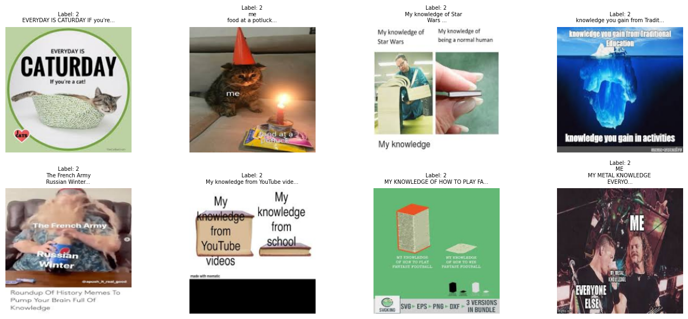
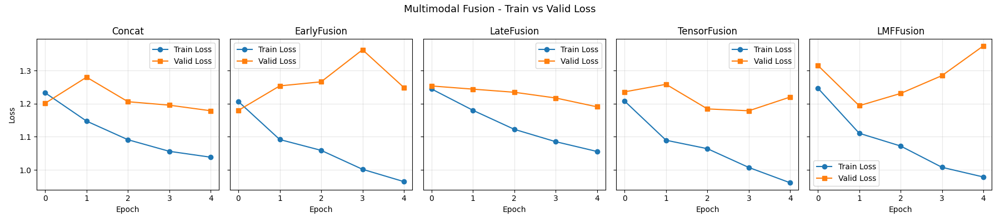
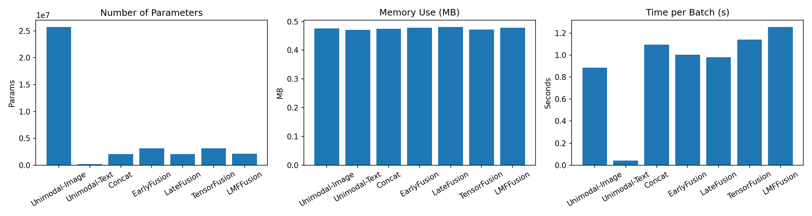

# HW2: Multimodal Fusion and Alignment — MET Meme

## Dataset

**MET Meme (filtered)** — 3,389 internet memes, each with an image and a text caption, annotated for intention (5 classes), sentiment, offensiveness, and metaphor occurrence. The primary task is **intention classification**.

| Split | Samples |
|---|---|
| Train | 2,711 |
| Validation | 338 |
| Test | 340 |

Sample memes from the dataset:

---

## Part 1: Multimodal Fusion

Five fusion strategies were evaluated, all using the same image encoder (CNN, output dim 64) and text encoder (frozen BERT → 768-dim → 64-dim), trained for 5 epochs with AdamW (lr=5e-4, weight_decay=1e-3).

### Results

| Model | Best Val Acc | Test Acc |
|---|---|---|
| Unimodal-Text | 46.15% | 46.47% |
| Unimodal-Image | 49.11% | 45.00% |
| Concat | 49.4% | 45.0% |
| EarlyFusion | 45.6% | 45.9% |
| LateFusion | 47.3% | 47.9% |
| TensorFusion | 47.6% | 47.6% |
| **LMFFusion** | 45.9% | **50.9%** |

**LMFFusion** achieves the best test accuracy. Its low-rank decomposition captures cross-modal interactions while acting as a regularizer — important given the limited training data.

### Train vs. Validation Loss

Key observations:
- **LMFFusion**: valid loss rises after Epoch 1 — clearest overfitting, but early stopping saves the best checkpoint
- **EarlyFusion**: best model is at Epoch 0, unstable afterwards
- **LateFusion**: valid loss decreases monotonically across all 5 epochs — model has not yet converged and could benefit from further training
- **Concat / TensorFusion**: minor fluctuations, no strong overfitting signal within 5 epochs

### Model Complexity

---

## Part 2: Contrastive Alignment

A contrastive learning model (`CLModel`) was trained to align image and text embeddings into a shared 128-dim space using InfoNCE loss (temperature τ=0.07), trained for 10 epochs with Adam (lr=3e-4).

**Zero-shot image-to-caption retrieval** was performed on the test set: given a query image, the model ranks candidate captions by cosine similarity in the learned embedding space — without any classification head.

Key findings:
- The model learns meaningful image-text correspondences on in-domain meme data
- Alignment quality is limited by the small dataset size and the niche visual style of memes
- Emergent alignment (as predicted by the Platonic Representation Hypothesis) is unlikely at this scale without in-domain pretraining

